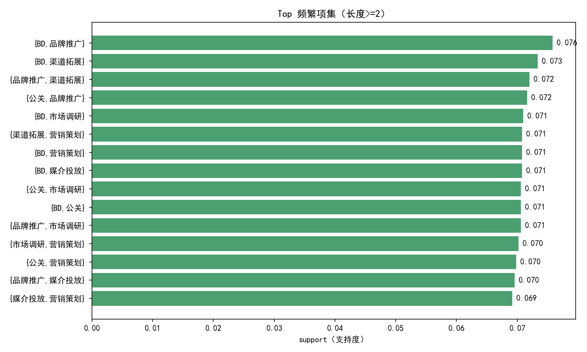
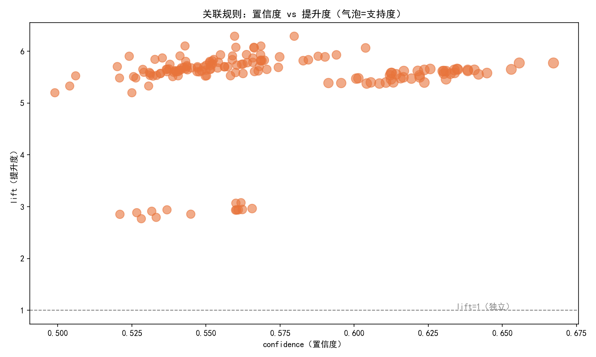
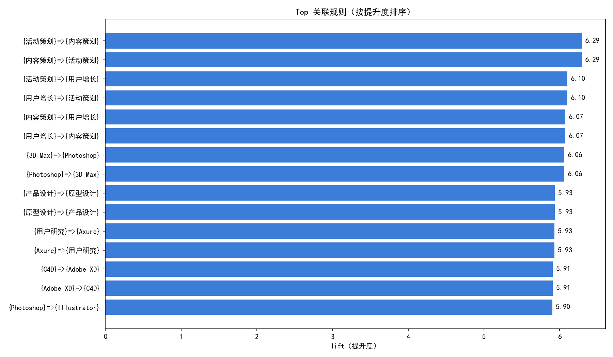
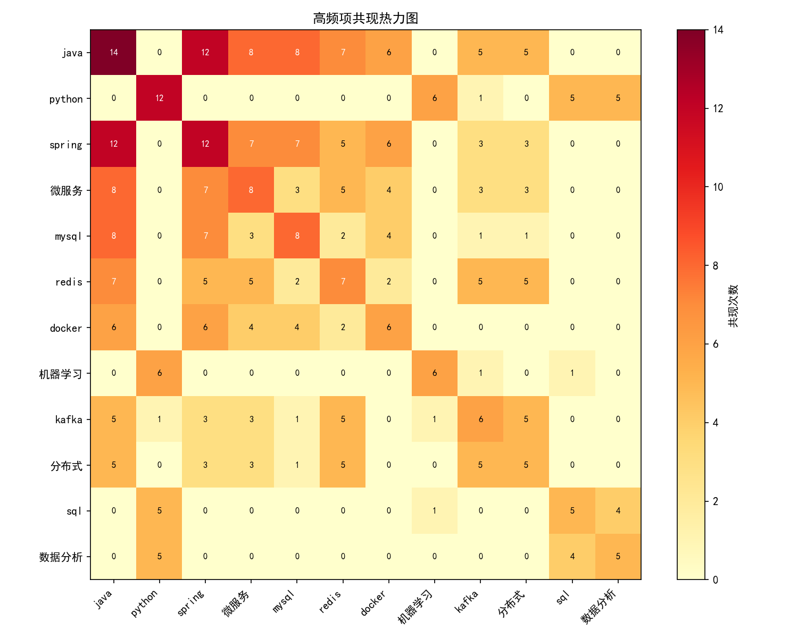

# 项目九 · 购物篮 / 技能组合分析（关联规则）

> 配属模型：关联规则 Apriori / FP-Growth
> 技术栈：Python / mlxtend / Spring Boot / Hadoop-HBase
> 难度：⭐⭐⭐（进阶）

## 一、项目简介

从「同时出现的项目集合」中挖掘强关联规则。经典案例「啤酒与尿布」——发现看似无关的商品常被一起购买。本项目支持两种数据：

- **购物篮版本**：每行是一个订单的商品列表
- **技能组合版本**（贴合招聘系统）：每行是一个岗位的技能要求，挖出「要求 java 的岗位常同时要求 spring/微服务」这类规律

## 二、核心指标

| 指标 | 含义 | 判定 |
|------|------|------|
| support（支持度） | 规则 P(A∪B) 出现的概率 | 越高越频繁 |
| confidence（置信度） | A 出现时 B 也出现的概率 P(B\|A) | 越高越可靠 |
| lift（提升度） | P(B\|A)/P(B) | >1 正相关，=1 独立，<1 负相关 |

## 三、项目结构

```
09-购物篮技能组合分析-关联规则/
├── config.py                 # Python 配置中心（路径 / 算法参数 / 加载私有配置）
├── main.py                   # 主入口：加载→编码→挖掘→规则→可视化→写回 HBase
├── serve_website.py          # 纯 Python 版网站服务（无虚拟机时本地演示用，同样占用 8080）
│                             # 注意：与 Spring Boot 端口相同，两者不要同时启动
│                             # 需要演示求职论坛时优先用 Spring Boot（见第八章）
├── Makefile                  # 一键任务入口（test / crawl / merge / model / gen-data / hbase-data / serve）
├── requirements.txt          # 核心依赖（训练 / 清洗 / 预测）
├── requirements-collect.txt  # 采集专用依赖（playwright / scrapling）
├── start_website.bat         # Windows 一键启动器（双击即用，见 6.8）
├── start_website.log         # 运行后生成：bat 六步执行日志（排障先看它）
├── .gitattributes/.gitignore # 行尾规范（bat=CRLF / sh=LF）与忽略规则
│
├── config/                   # 配置目录
│   ├── local.env.example     # ★ 私有配置模板：复制成 local.env 填自己的地址与密码（见 6.1）
│   ├── local.env             # ✗ 本机真实值，不入库（已 gitignore）
│   ├── hadoop.yml            # Hadoop 集群参数
│   └── project.yml           # 部署拓扑参考（纯占位符文档，不参与运行）
│
├── src/                      # Python 算法层
│   ├── data_loader.py        # 数据加载与概览
│   ├── preprocessor.py       # TransactionEncoder 0/1 项集编码
│   ├── model.py              # Apriori / FP-Growth 频繁项集
│   ├── evaluator.py          # 规则生成 + support/confidence/lift 筛选
│   ├── hbase_connector.py    # HBase 读写（连不上自动降级为本地 CSV）
│   ├── visualizer.py         # matplotlib 图表 + ECharts HTML 看板
│   ├── analysis/             # XGBoost 薪资预测：features.py 特征工程 / train.py 训练
│   ├── ingest/               # 采集与入库：collect_v5 / merge_clean / generate / update_tier_hbase
│   └── serving/predict_api/  # 预测服务 serve_api.py（端口 8788）
│
├── data/
│   ├── raw/                  # market_basket.csv（购物篮）/ recruit_skills.tsv（技能事务）
│   ├── clean/                # recruit_clean.tsv（清洗后招聘数据，10 列契约）
│   └── processed/            # 产出：频繁项集 / 关联规则 / 项频次
│
├── outputs/
│   ├── charts/               # ★ 4 张 PNG + index.html 大屏 + app.js + 2 个规则图 HTML
│   │   └── js/               # 大屏用的本地化 echarts 库（已入库，离线可用）
│   └── reports/              # strong_rules_readable.csv（业务可读强规则）
│
├── artifacts/models/         # salary_predictor.pkl（XGBoost 模型）
├── schemas/                  # 数据契约 JSON（recruit.tsv.json / hbase-tables.json）
├── tests/test_schema.py      # 10 列数据契约校验（make test）
├── tools/ssh_helper.py       # SSH 远程执行与文件传输
├── scripts/
│   ├── deploy.py             # 一键部署到虚拟机（SFTP + mvn + 启动）
│   ├── gen_data.py           # 生成 1200 条岗位 + 测试用户，灌入 HBase
│   ├── gen_realistic_data.py # 生成贴近真实的招聘数据（天池数据集的本地替代）
│   ├── import_tianchi_data.py# 导入天池岗位数据集（5000 条真实招聘数据）
│   └── export_forum_json.py  # ★ 把 forum_data.py 导出为后端可读的 forum-data.json
│
├── deploy/
│   ├── setup/install_hadoop_hbase.sh   # 大数据层一键安装
│   └── run/                  # vm_autostart.sh（VM 开机自启）、install_cron.sh
│                             # s4_predict_start.sh / s5_backend_start.sh
│                             # deploy_predict.sh / fix_upload_rebuild.sh
│
└── day08-backend/            # Spring Boot 2.7.18 + Spring Security + JWT + HBase Client
    ├── pom.xml
    └── src/main/
        ├── java/com/example/demo/   # controller(10) / service(5) / config / filter / util
        └── resources/
            ├── application.properties
            └── static/              # 14 个页面 + ECharts + 公共 JS/CSS
```

## 四、快速开始（本地纯 Python 模式）

```bash
pip install -r requirements.txt
python main.py          # 默认 DATA_SOURCE=skills，生成 CSV + 图表到 outputs/
```

切换数据源：编辑 `config.py` 中 `DATA_SOURCE = "basket"` 或 `"skills"`。

> **产物可复现**：`main.py` 会在启动时把 `PYTHONHASHSEED` 钉成 `0`（未设置时自动 `os.execv` 重启自己）。
> 原因：项集是 `frozenset`，它的打印顺序由字符串哈希决定，而 Python 默认给哈希加随机盐 ——
> 不钉种子的话，每次运行 `frequent_itemsets.csv`、`association_rules.csv`、`top_rules.png`
> 和两个 ECharts HTML 的字节内容都会变（**挖掘结果其实完全一样，只是 `frozenset({'java','spring'})`
> 与 `frozenset({'spring','java'})` 的区别**）。
> 需要复现某次运行的产物时，别覆盖这个行为。

## 五、可视化输出

### 5.1 静态图表

**高频技能项支持度 Top 15** —— 哪些技能出现得最普遍，是后续组合挖掘的"素材池"：



**置信度 vs 提升度散点** —— 每个点是一条规则。右上角（置信度高 + 提升度大）才是真正有价值的强规则；提升度 < 1 的点位于虚线下方，属于"负相关"，已被规则筛选阶段剔除：



**Top 强规则条形图** —— 按提升度排序的前 15 条规则，横轴长度即提升度：



**高频项共现热力图** —— 行/列都是高频技能，格子颜色越深表示两者共同出现的频次越高，用于快速定位"抱团出现"的技能簇：



### 5.2 交互式看板

| 文件 | 内容 |
|------|------|
| `top_itemsets.png` | 频繁项集支持度条形图 |
| `rules_scatter.png` | 置信度 vs 提升度散点图 |
| `top_rules.png` | Top 强规则条形图 |
| `cooccurrence_heatmap.png` | 高频项共现热力图 |
| `index.html` + `app.js` | day8 风格 4-panel 大屏（词云 / 散点 / 规则分布 / 关联网络） |
| `rules_network.html` | ECharts 交互式规则网络（单文件，走 CDN） |
| `rules_heatmap.html` | ECharts 交互式规则热力图（单文件，走 CDN） |
| `js/echarts.min.js`、`js/echarts-wordcloud.min.js` | 大屏用的本地化 echarts 库（已随仓库提交，离线可用） |

> 图表的生成逻辑在 `src/visualizer.py`，跑一次 `python main.py` 即可重新产出。
> 大屏 `index.html` 引用的是**本地** `js/` 目录；若这两个文件缺失，
> `src/visualizer.py::_ensure_echarts_libs()` 会在运行时自动从 jsDelivr 下载补齐。
> 另外两个 HTML 直接走 CDN，需要联网。

## 六、完整部署（虚拟机 + 大数据全栈）

本项目由 Python 算法层、Spring Boot 后端、HBase 大数据层、前端 ECharts 四部分组成，统一部署到一台 Linux 虚拟机。**所有环境相关参数均通过环境变量注入，迁移到新环境只需改一组变量，无需改动代码或脚本正文。**

### 6.1 部署变量（迁移时只改这里）

#### 方式 A —— 写进 `config/local.env`（推荐，代码与启动脚本都读它）

真实地址与密码**不入库**。仓库里只有模板 `config/local.env.example`，复制一份改名 `local.env` 填自己的值即可（`config/local.env` 已在 `.gitignore` 中）：

```bash
cp config/local.env.example config/local.env
# 然后编辑 config/local.env，填你自己的值
```

```ini
# config/local.env —— 本机私有，不入库
VM_HOST=192.168.1.100        # 你的虚拟机 / 服务器地址
VM_SSH_USER=your-user        # SSH 用户名
VM_SSH_PASSWORD=             # SSH 密码；已配置密钥免密就留空
HBASE_HOST=192.168.1.100     # HBase Thrift 地址（通常与 VM_HOST 相同）
HBASE_PORT=9090
```

> 两个格式要求：**注释独占一行**、**值后面不要再跟 `# 注释`**（`start_website.bat` 用 `for /f` 逐行切分，会把注释一起当成值）；文件请用 **CRLF 行尾**（模板已经是 CRLF，用 `cp`/复制保持即可，Python 侧两种行尾都能读）。

**谁读这个文件**：

| 读取方 | 用途 |
|---|---|
| `config.py` | 解析后暴露成 `config.VM_HOST / VM_SSH_USER / VM_SSH_PASSWORD / HBASE_HOST / HBASE_PORT` |
| `main.py`、`src/hbase_connector.py`、`src/analysis/train.py`、`src/ingest/update_tier_hbase.py`、`scripts/gen_data.py` | 连 HBase 时取地址端口 |
| `scripts/deploy.py`、`tools/ssh_helper.py` | 取 SSH 地址 / 用户 / 密码 |
| `start_website.bat` | 双击启动器自己解析 `config\local.env` 拿 `VM_HOST` / `VM_SSH_USER` |

> **优先级**：同名环境变量 > `config/local.env` > 代码里的占位默认值。临时覆盖直接 `export VM_HOST=...` 即可。
> 没配 `local.env` 时程序会落到占位默认值（`127.0.0.1` / `your-user` / 空密码），表现为**连不上**，而不是把真实秘密写进代码。

#### 方式 B —— 在 shell 里导出变量（仅当次会话有效）

部署前先在主机与虚拟机的 shell 中导出以下变量。下文所有命令均引用这些变量，不再硬编码任何 IP/用户/路径。

```bash
# === 虚拟机连接 ===
export VM_IP=<你的虚拟机IP>          # 例如 192.168.1.100
export VM_USER=<你的SSH用户>
export VM_PASS=<你的SSH密码>         # 已配置密钥免密则不需要
export VM_HOME=/home/$VM_USER        # 部署根目录

# === 大数据层 ===
export HADOOP_HOME=/opt/hadoop
export HBASE_HOME=/opt/hbase
export ZK_QUORUM=$VM_IP              # HBase ZK 地址（通常=虚拟机 IP）
export ZK_PORT=2181
export THRIFT_PORT=9090             # Python happybase 入口

# === 服务端口 ===
export BACKEND_PORT=8080            # Spring Boot
export PREDICT_PORT=8788            # Python 预测服务

# === Java ===
export JAVA_HOME=/usr/lib/jvm/java-11-openjdk-amd64
export PATH=$JAVA_HOME/bin:$PATH
```

> 迁移到新机器时，**只要改方式 A 的 `config/local.env`（或方式 B 的这组 shell 变量）就够了**。
> 历史上还需要手改 5 个文件里的硬编码 IP/密码，那些硬编码已经全部移除，改为统一读 `config/local.env`，见 **6.8.0** 的对照表。

### 6.2 部署架构

| 层 | 组件 | 端口 | 说明 |
|----|------|------|------|
| 大数据 | Hadoop HDFS/YARN | 9000/8088 | 底层存储与资源管理 |
| 大数据 | HBase Master / ZK / Thrift | 16000 / 2181 / 9090 | 规则存储 + Python 入口 |
| 算法 | Python 预测服务 | 8788 | XGBoost 薪资预测 API |
| Web | Spring Boot 后端 | 8080 | 招聘网站 + 关联规则 API |
| Web | 前端静态资源 | 8080/static | 内嵌 Tomcat 托管，无需 Nginx |

访问入口：`http://$VM_IP:8080/`  测试账号：`admin / 123456`

### 6.3 步骤 1 — 虚拟机环境准备

Ubuntu 22.04 LTS，建议 4 核 8G 50G。固定 IP 后主机验证连通性：

```bash
ping $VM_IP    # 主机 PowerShell 验证
```

虚拟机内安装基础环境（JDK 11 + Maven + Python3）：

```bash
sudo apt update && sudo apt install -y openjdk-11-jdk maven python3 python3-pip
java -version && mvn -version && python3 --version
```

开放大数据端口（仅开发环境）：

```bash
sudo ufw allow 2181/9090/16000/8080/8788
```

### 6.4 步骤 2 — Hadoop + HBase 大数据层

使用项目内置脚本一键安装 Hadoop 2.10.2 + HBase 2.5.9 + Thrift：

```bash
# 主机执行：上传脚本到虚拟机并运行
scp deploy/setup/install_hadoop_hbase.sh $VM_USER@$VM_IP:/tmp/
ssh $VM_USER@$VM_IP "bash /tmp/install_hadoop_hbase.sh"
```

脚本完成后 `jps` 应出现：NameNode、DataNode、ResourceManager、HMaster、HRegionServer、ThriftServer。

**重启后手动拉起**（环境变量已在脚本中写入 `~/.bashrc`）：

```bash
ssh $VM_USER@$VM_IP
source ~/.bashrc
$HADOOP_HOME/sbin/start-dfs.sh && $HADOOP_HOME/sbin/start-yarn.sh
$HBASE_HOME/bin/start-hbase.sh && $HBASE_HOME/bin/hbase-daemon.sh start thrift
jps
```

**建表**（首次部署）：

```bash
$HBASE_HOME/bin/hbase shell <<'EOF'
create 'recruit_assoc_rules','info'
create 'recruit_keyword','info'
create 'recruit_job','info'
create 'recruit_user','info'
exit
EOF
```

### 6.5 步骤 3 — Python 算法层（预测服务 + 关联规则）

Python 层包含两部分：① 薪资预测服务（常驻 8788 端口）；② 关联规则挖掘（跑一次，结果写 HBase）。

#### 6.5.1 部署 predict 薪资预测服务到 VM

predict 服务需要 3 个文件：`serve_api.py`（服务代码）、`salary_predictor.pkl`（XGBoost 模型）、`features.py`（特征工程）。用内置脚本一键部署：

```bash
# 主机执行（需先配好 SSH 免密，见 6.8.3）
bash deploy/run/deploy_predict.sh
```

脚本会自动在 VM 上创建 `/home/$VM_USER/predict/` 目录并上传全部文件。`serve_api.py` 的路径逻辑已自适应：本地用项目根布局，VM 用 predict 目录布局，无需手动改路径。

#### 6.5.2 启动 predict 服务

```bash
ssh $VM_USER@$VM_IP
cd $VM_HOME/predict
pip3 install numpy scikit-learn          # 首次部署装依赖
nohup python3 serve_api.py 8788 > predict.log 2>&1 &
sleep 5
curl http://localhost:$PREDICT_PORT/api/overview    # 验证返回 JSON
```

#### 6.5.3 关联规则挖掘（写 HBase，首次部署跑一次）

关联规则挖掘需要完整项目结构（config.py + src/ + data/raw/）。把项目传到 VM 跑一次：

```bash
# 主机执行：上传 Python 项目到 VM
scp -r src config.py main.py requirements.txt $VM_USER@$VM_IP:$VM_HOME/

ssh $VM_USER@$VM_IP
cd $VM_HOME
pip3 install -r requirements.txt happybase

# 确认 HBase Thrift 已启动（6.4 步骤）
curl -v http://localhost:$THRIFT_PORT

# 跑关联规则挖掘（结果自动写入 HBase recruit_assoc_rules 表）
python3 main.py

# 验证 HBase 有数据
echo "scan 'recruit_assoc_rules', {LIMIT => 3}" | $HBASE_HOME/bin/hbase shell
```

> 关联规则只需跑一次，结果持久化在 HBase 里。之后 VM 重启不需要重跑，除非要换数据源重新挖掘。

### 6.6 步骤 4 — Spring Boot 后端 + 前端

后端位于 `day08-backend/`，技术栈 Spring Boot 2.7.18 + Spring Security + JWT + HBase Client 2.5.9。

**关键配置**：HBase 连接通过 `application.properties` 注入。仓库里的默认值是 `127.0.0.1`（后端与 HBase 同机部署时够用），部署到单独的 HBase 服务器时用环境变量覆盖：

```properties
# day08-backend/src/main/resources/application.properties
server.port=${BACKEND_PORT:8080}
hbase.zookeeper.quorum=${ZK_QUORUM:127.0.0.1}
hbase.zookeeper.property.clientPort=${ZK_PORT:2181}
```

```bash
# HBase 在另一台机器时，启动 jar 时覆盖（或在 VM 上 export ZK_QUORUM）
java -jar target/demo-0.0.1-SNAPSHOT.jar --hbase.zookeeper.quorum=$ZK_QUORUM
```

**部署方式 A — 一键脚本**（Windows 主机，自动 SFTP + mvn 打包 + 启动）：

```bash
python scripts/deploy.py
```

`deploy.py` 的连接信息（`HOST / USER / PASS`）不再写死在文件里，而是从 `config/local.env` 读取，见 6.1；需要搬走整个部署目录时用 `VM_REMOTE_ROOT` 环境变量覆盖。

**部署方式 B — 手动**（虚拟机内）：

```bash
# 主机传代码
scp -r day08-backend $VM_USER@$VM_IP:$VM_HOME/day08

ssh $VM_USER@$VM_IP
cd $VM_HOME/day08

# 关键：解决 HBase client 与 Spring Boot 自带 ZK 版本冲突
export HADOOP_CLASSPATH=$($HBASE_HOME/bin/hbase classpath)

mvn clean package -DskipTests
nohup java -jar target/demo-0.0.1-SNAPSHOT.jar > app.log 2>&1 &
sleep 15

curl http://localhost:$BACKEND_PORT/api/hello    # 期望：「招聘分析系统后端已启动」
```

前端 HTML/CSS/JS 位于 `day08-backend/src/main/resources/static/`，随 jar 内嵌 Tomcat 托管，**无需 Nginx**。页面：index / login / register / search / detail / dashboard（ECharts 大屏）。

### 6.7 步骤 5 — 验证与访问

| 检查项 | 命令 | 期望 |
|--------|------|------|
| HBase 进程 | `jps` | HMaster / HRegionServer / ThriftServer |
| Thrift 端口 | `curl -v http://$VM_IP:$THRIFT_PORT` | 端口可达 |
| 预测服务 | `curl http://$VM_IP:$PREDICT_PORT/api/overview` | JSON |
| 后端健康 | `curl http://$VM_IP:$BACKEND_PORT/api/hello` | 「招聘分析系统后端已启动」 |
| 关联规则 API | `curl http://$VM_IP:$BACKEND_PORT/api/rules/strong` | 规则列表 JSON |
| 频繁项集 API | `curl http://$VM_IP:$BACKEND_PORT/api/rules/frequent` | 项集 JSON |
| 前端 | 浏览器 `http://$VM_IP:$BACKEND_PORT/` | 首页 |
| 大屏 | `http://$VM_IP:$BACKEND_PORT/dashboard.html` | ECharts 加载 |

> ⚠️ 注意：规则接口是 `/api/rules/strong` 和 `/api/rules/frequent`，**没有** `/api/rules` 这个裸路径（访问会返回 404）。

**Windows 主机一键访问**：双击 `start_website.bat`（自动 ping → SSH 兜底拉起 → 开浏览器）。每次运行都会在同目录写一份 `start_website.log`，出问题先看它。

### 6.8 一键启动配置（新电脑部署必做）

完成 6.3-6.7 后网站能手动启动，但**双击 `start_website.bat` 往往还是开不了** —— 因为 bat 能兜底拉起服务，靠的是三个前置条件：VM 能自动拉起服务、SSH 能免密登录、bat 自身参数与文件格式正确。**三个条件缺一个，bat 就会静默失败**：网站打不开，而且屏幕上什么错都不报。

本节按 6.8.1 → 6.8.5 顺序做，最后一步是验收标准。**新机器部署必须完整走完，否则关机后服务不会自动恢复。**

#### 6.8.0 迁移总览：换一台机器一共只改 2 处

| # | 文件 | 改什么 |
|---|------|--------|
| 1 | `config/local.env`（不入库，从 `local.env.example` 复制） | `VM_HOST` / `VM_SSH_USER` / `VM_SSH_PASSWORD` / `HBASE_HOST` / `HBASE_PORT` |
| 2 | `~/.ssh/config`（主机侧） | 把密钥绑定到新 VM 的 IP，供 bat 免密登录用 |

**就这么两处。** 代码与脚本里的硬编码地址、用户名、密码已经全部移除，统一改为读 `config/local.env`：

| 原硬编码位置 | 现状 |
|---|---|
| `start_website.bat` 顶部 `set "VM_IP=..." / set "VM_USER=..."` | 改为运行时解析 `config\local.env`，文件内已无地址与用户名 |
| `scripts/deploy.py` 第 7 行 `HOST / USER / PASS` | 改为 `config.VM_HOST / VM_SSH_USER / VM_SSH_PASSWORD`；`REMOTE_ROOT` 由 `$HOME` 推导，可用 `VM_REMOTE_ROOT` 覆盖 |
| `tools/ssh_helper.py` 构造参数默认值 | 改为从 `config` 取 |
| `scripts/gen_data.py` 的 `HOST / PORT` | 改为 `config.HBASE_HOST / HBASE_PORT` |
| `src/analysis/train.py`、`src/ingest/update_tier_hbase.py` 里写死的 HBase 地址 | 改为 `config.HBASE_HOST / HBASE_PORT`；顺带把写死的 `D:\...` 绝对路径改成按脚本位置推导 |
| `deploy/run/*.sh` 里写死的 `/home/<user>/...` | 改为 `$HOME`，换用户名不用动脚本 |
| `day08-backend/.../application.properties` 的 ZK 地址 | 改为 `${ZK_QUORUM:127.0.0.1}`，部署时用环境变量注入 |

> 唯一还需要手改的外部文件是主机侧 `~/.ssh/config`（把 `Host` 与 `User` 换成你的 VM）—— 它是 SSH 自己的配置，不属于项目仓库。

#### 6.8.1 上传 vm_autostart.sh 到 VM

`deploy/run/vm_autostart.sh` 按依赖顺序启动全部 5 个服务（Hadoop → HBase → Thrift → Spring Boot → predict）：

```bash
# 主机执行
scp deploy/run/vm_autostart.sh $VM_USER@$VM_IP:$VM_HOME/
ssh $VM_USER@$VM_IP "chmod +x $VM_HOME/vm_autostart.sh && dos2unix $VM_HOME/vm_autostart.sh"
```

> `dos2unix` 不能省：Windows 上传的脚本带 CRLF，Linux 会报 `bad interpreter`。

#### 6.8.1.1 ⚠️ 最大的坑：`.bashrc` 的非交互守卫会让自启脚本静默失效

**症状**：VM 重启后服务起不来。双击 bat 只看到 `[WARN] Big data layer still not complete`，浏览器打开是空白或报错。

**原因**：`install_hadoop_hbase.sh` 是把环境变量 **追加到 `~/.bashrc` 末尾**的，而 Ubuntu 默认 `.bashrc` 开头有一段非交互守卫：

```bash
# ~/.bashrc 第 6-9 行，Ubuntu 默认自带
case $- in
    *i*) ;;
      *) return;;      # ← 非交互 shell 走到这里就 return 了
esac
```

cron 的 `@reboot` 和 `ssh 主机 "命令"` 都属于**非交互 shell**，`source ~/.bashrc` 会在第 9 行直接 return，排在后面的 `export HADOOP_HOME=...`（参考 VM 上在 118-125 行）**根本不会执行**。实测：

```bash
$ ssh $VM_USER@$VM_IP 'bash -c "source ~/.bashrc; echo $HADOOP_HOME"'
                                     # ← 输出为空

$ ssh $VM_USER@$VM_IP 'bash -c "source ~/.bashrc; echo $HADOOP_HOME/sbin/start-dfs.sh"'
/sbin/start-dfs.sh                   # ← 路径塌成 /sbin，启动命令静默失败
```

**修法（推荐 A，二选一）**：

**A. 让 `vm_autostart.sh` 自包含**（不依赖 `.bashrc`，最稳）。把脚本开头的 `source ~/.bashrc 2>/dev/null` 替换为：

```bash
# ---------- 环境变量（非交互 shell 下 .bashrc 会被守卫拦截，这里显式声明）----------
export JAVA_HOME=${JAVA_HOME:-/usr/lib/jvm/java-11-openjdk-amd64}
export HADOOP_HOME=${HADOOP_HOME:-/opt/hadoop}
export HBASE_HOME=${HBASE_HOME:-/opt/hbase}
export PATH=$JAVA_HOME/bin:$HADOOP_HOME/bin:$HADOOP_HOME/sbin:$HBASE_HOME/bin:$PATH
```

**B. 把 `.bashrc` 里的 export 挪到守卫之前**：

```bash
ssh $VM_USER@$VM_IP
nano ~/.bashrc     # 把那组 export 剪切到第 5 行（case $- in 之前）
```

**验证（两条都必须通过）**：

```bash
# 必须输出真实路径，不能为空
ssh $VM_USER@$VM_IP 'bash -c "source ~/.bashrc; echo $HADOOP_HOME"'

# 直接跑自启脚本，然后复查进程
ssh $VM_USER@$VM_IP "bash $VM_HOME/vm_autostart.sh; sleep 45; jps"
# 期望看到 NameNode / DataNode / ResourceManager / HMaster / HRegionServer / ThriftServer
```

> 上面默认的 `/opt/hadoop`、`/opt/hbase` 与 6.1 一致，是参考 VM 的实测路径。若你的安装目录不同（例如 `install_hadoop_hbase.sh` 装到 `/usr/local/...`），**务必同步改掉**，见 6.9 最后一条。

#### 6.8.2 配置 cron 开机自启

```bash
# 主机执行：上传并安装（install_cron.sh 会重置 crontab，只保留这一条）
scp deploy/run/install_cron.sh $VM_USER@$VM_IP:$VM_HOME/
ssh $VM_USER@$VM_IP "chmod +x $VM_HOME/install_cron.sh && dos2unix $VM_HOME/install_cron.sh && bash $VM_HOME/install_cron.sh"
```

等价的纯手动写法：

```bash
ssh $VM_USER@$VM_IP
sudo systemctl enable cron
echo "@reboot $VM_HOME/vm_autostart.sh >> $VM_HOME/autostart.log 2>&1" | crontab -
crontab -l    # 应显示 @reboot 行
```

> **必须做自启验证，不要跳过**：`ssh $VM_USER@$VM_IP "sudo reboot"`，等 60 秒后 `ssh $VM_USER@$VM_IP "jps"`，6 个进程齐全才算过（配合 6.8.1.1 一起验）。**这一步不过，VM 重启后双击 bat 必然失败。**
>
> **边界条件**：cron 的 `@reboot` 只在 VM 真正开机/重启时触发。VMware 的「挂起 → 恢复」不触发，此时靠 6.8.4 的 bat 兜底。

#### 6.8.3 配置 SSH 免密登录（决定 bat 能不能兜底）

bat 的 2/3/4 步都用 `ssh -o BatchMode=yes` 非交互进 VM 拉起服务。**BatchMode 下不会弹密码框，认证失败就直接静默失败** —— 表现出来就是「网站打不开，但屏幕上没有任何报错」。所以免密必须配好。

> **关键点：密钥文件名随便叫什么都行，但 ssh 必须能找到它。** 参考机器上私钥叫 `id_ed25519_trae`（不是 OpenSSH 默认查找的 `id_ed25519`），又没有 `~/.ssh/config`，结果 bat 的免密全线静默失败 —— 这就是最典型的踩坑现场。

**① 生成密钥**（已有可跳过）：

```powershell
# 用默认名（最省事）
ssh-keygen -t ed25519 -f $env:USERPROFILE\.ssh\id_ed25519 -N '""'

# 或用自定义名（推荐，便于与其它项目的密钥区分）
ssh-keygen -t ed25519 -f $env:USERPROFILE\.ssh\id_ed25519_trae -N '""'
```

**② 公钥装到 VM**（输一次 VM 密码）：

```powershell
type $env:USERPROFILE\.ssh\id_ed25519_trae.pub | ssh $VM_USER@$VM_IP "mkdir -p ~/.ssh && cat >> ~/.ssh/authorized_keys && chmod 600 ~/.ssh/authorized_keys"
```

**③ 让 ssh 认得这个密钥名** —— 新建 `%USERPROFILE%\.ssh\config`（无扩展名，纯文本，**不要带 BOM，也不要存成 UTF-16**）：

```
Host <你的虚拟机IP>              # 与 config/local.env 里的 VM_HOST 保持一致
    User <你的SSH用户名>          # 与 VM_SSH_USER 保持一致
    IdentityFile ~/.ssh/id_ed25519_trae
    StrictHostKeyChecking accept-new
    ConnectTimeout 6
```

**④ 收紧私钥权限** —— Windows 自带的 `ssh.exe` 会拒绝权限过松的私钥（Git Bash 自带的 ssh 宽松，所以很容易「Bash 里能通、cmd 里不通」）：

```powershell
icacls "$env:USERPROFILE\.ssh\id_ed25519_trae" /inheritance:r /grant:r "$env:USERNAME:(R)"
```

**⑤ 验证 —— 必须用与 bat 完全一致的调用方式**（不带 `-i`，靠 config 找到密钥）：

```powershell
ssh -o BatchMode=yes -o ConnectTimeout=6 $VM_USER@$VM_IP "echo OK"
# 必须直接打印 OK。若报 Permission denied (publickey,password) 或弹密码 → bat 的兜底必然失败
```

> 排错：`ssh -v $VM_USER@$VM_IP` 会打印它到底加载了哪把密钥（看 `identity file ... type 0` 那几行）。

#### 6.8.4 配置 start_website.bat

**① 不用改 bat 了** —— 地址和用户名不再写在 bat 里。双击时它会自己解析 `config\local.env` 拿 `VM_HOST` / `VM_SSH_USER`：

```bat
REM start_website.bat 里的实际逻辑（正文，不需要改）
if exist "%~dp0config\local.env" (
    for /f "usebackq tokens=1,* delims==" %%a in ("%~dp0config\local.env") do (
        if /i "%%a"=="VM_HOST" set "VM_IP=%%b"
        if /i "%%a"=="VM_SSH_USER" set "VM_USER=%%b"
    )
)
if not defined VM_IP (
    echo   [ERROR] VM_HOST not found in config\local.env
    ...
    pause
    exit /b 1
)
```

所以只要 `config\local.env` 存在且填好了 `VM_HOST`，bat 就能跑；找不到这个文件时会**明确报错并 pause**（不会像以前那样静默失败）。端口仍是 bat 内的 `BACKEND_PORT=8080` / `PREDICT_PORT=8788`，要改直接改这两行。

**② 保证文件格式正确（新电脑上最容易翻车的点）** —— `.bat` 必须是 **CRLF 行尾 + 纯 ASCII**：

- 行尾必须是 **CRLF**。被 Linux / WSL / 在线编辑器改成 LF 后，cmd.exe 解析多行 `if (...)` 块会出错，表现为双击后行为诡异或直接退出。
- 内容不要出现非 ASCII 字符（中文）。cmd.exe 按控制台代码页读取 bat，UTF-8 中文会变乱码，`findstr` 之类的中文比较**永远不成立**，于是无论服务是否正常都报 `[WARN]`。

一键检查 + 修复（主机 PowerShell，在项目根目录执行）：

```powershell
$p = "$PWD\start_website.bat"

# 检查：期望「非ASCII字节=0」
$b = [IO.File]::ReadAllBytes($p)
$crlf = 0; for ($i = 0; $i -lt $b.Length - 1; $i++) { if ($b[$i] -eq 13 -and $b[$i+1] -eq 10) { $crlf++ } }
"CRLF=$crlf  非ASCII字节=" + @($b | Where-Object { $_ -gt 127 }).Count

# 修复：统一转成 CRLF + ASCII
$t = [IO.File]::ReadAllText($p) -replace "`r`n", "`n" -replace "`n", "`r`n"
[IO.File]::WriteAllText($p, $t, [Text.Encoding]::ASCII)
```

**③ 确认 `.bat` 关联没被改过** —— 若 `.bat` 被关联到记事本，双击只会打开文本而不执行：

```powershell
(Get-ItemProperty 'HKLM:\SOFTWARE\Classes\.bat').'(default)'          # 期望：batfile
Test-Path 'HKCU:\Software\Microsoft\Windows\CurrentVersion\Explorer\FileExts\.bat\UserChoice'
   # 期望：False。若为 True，说明被改成别的默认程序，去「设置 → 应用 → 默认应用 → 按文件类型」改回
```

bat 的 6 步逻辑：

| 步骤 | 做什么 | 失败时 |
|------|--------|--------|
| 1/6 | ping VM（2 个包，带容错） | 只告警，**不退出**，继续往下查 HTTP |
| 2/6 | SSH 查大数据层（HMaster/NameNode/ThriftServer） | SSH 跑 `vm_autostart.sh`，等 40s 后复查 |
| 3/6 | HTTP 查 Spring Boot:8080 | SSH 拉起 jar，等 25s |
| 4/6 | HTTP 查 predict:8788 | SSH 拉起 `serve_api.py`，等 8s |
| 5/6 | 复查 `/api/hello` | 再等 15s |
| 6/6 | 打开浏览器 | — |

全程写日志到同目录 `start_website.log`。

#### 6.8.5 验收：双击 start_website.bat

**前置**：VM 已开机 → `jps` 6 个进程齐全 → 6.8.3 的免密验证能直接打印 `OK`。

**验收动作**：在文件资源管理器里**双击** `start_website.bat`。

**通过的标志**：

1. 窗口逐步打印 `[1/6]` ~ `[6/6]`；2、3、4 步显示 `OK` / `running`，全程没有 `[WARN]`
2. 浏览器自动打开 `http://<VM_IP>:8080/`，显示「智聘 · 招聘分析平台」首页
3. 同目录生成的 `start_website.log` 六步记录齐全

**没通过的排错顺序**：

1. 打开 `start_website.log`，看停在第几步、那一步写了什么
2. 第 2/3/4 步 SSH 失败 → 回 6.8.3 重测免密
3. 第 2 步 `still not complete` → 回 6.8.1.1 查环境变量
4. 窗口一闪而过 / 完全没有输出 → 回 6.8.4 的 ②③ 查文件格式与关联

> **日常使用**：启动 VMware + 开 VM（或从挂起恢复）→ 双击 `start_website.bat`。cron 自动拉起服务（约 40-60s），bat 再做兜底复查，不用手动 SSH 进 VM。

### 6.9 常见问题

**一键启动（bat）相关**

| 问题 | 原因与解决 |
|------|-----------|
| **双击 bat 网站打不开、屏幕无任何报错** | 先看同目录 `start_website.log`。多数是 SSH 免密没配好（BatchMode 静默失败）→ 6.8.3 |
| **VM 重启后服务起不来** | `.bashrc` 的非交互守卫导致 `$HADOOP_HOME` 为空，自启脚本静默失败 → 6.8.1.1 |
| 双击窗口一闪而过 / 没反应 | `.bat` 被关联到编辑器，或行尾是 LF → 6.8.4 的 ②③ |
| `ssh` 在 Bash 里能免密、在 cmd 里却不行 | Windows 自带 `ssh.exe` 对私钥权限更严格 → 6.8.3 ④ 的 `icacls` |
| 报 `Permission denied (publickey,password)` | 密钥名不是默认名却没有 `~/.ssh/config` → 6.8.3 ③ |
| bat 总报 `[WARN] Backend not fully ready` | 旧版用 `findstr` 匹配中文，编码不匹配必然失败；现版已改为判断 HTTP 退出码 → 6.8.4 ② |

**服务与数据相关**

| 问题 | 原因与解决 |
|------|-----------|
| Spring Boot 启动 ZK 版本冲突 | `export HADOOP_CLASSPATH=$(hbase classpath)` 后再 `java -jar`。注意脚本里 `hbase` 建议用绝对路径，如 `/opt/hbase/bin/hbase` |
| HBase 连接超时 | 检查 ZK 端口、`sudo ufw allow 2181/9090/16000` |
| happybase 连接失败 | `$HBASE_HOME/bin/hbase-daemon.sh start thrift` |
| Maven 打包失败 | 确认 `JAVA_HOME` 指向 Java 11 |
| echarts 前端缺失 | `deploy.py` 会跳过大文件，手动 `scp` 上传 `static/js/echarts.min.js`（约 1.0 MB） |
| 8080 端口占用 | `pkill -f demo-0.0.1-SNAPSHOT.jar` |
| 访问 `/api/rules` 返回 404 | 接口是 `/api/rules/strong` 与 `/api/rules/frequent`，**没有**裸路径 `/api/rules` |
| 脚本报 `bad interpreter: ^M` | Windows 上传的脚本带 CRLF，`dos2unix` 处理后再执行 |
| **Hadoop/HBase 安装路径不一致** | `deploy/setup/install_hadoop_hbase.sh` 装到 `/usr/local/{hadoop,hbase}`，而参考 VM 实际用 `/opt/{hadoop,hbase}`（6.1 与 vm_autostart.sh 均按 `/opt` 写），`s5_backend_start.sh` 里又写死 `/usr/local/hbase`。**二选一并让全套脚本 + 6.1 变量 + 6.8.1.1 的 export 保持一致**，否则自启必然失败 |

### 6.10 新电脑部署自查清单

从零到「双击可用」，把下面 12 条逐条跑出期望结果。全绿之后，双击 `start_website.bat` 必然成功。

| # | 验证项 | 命令（主机 PowerShell / Bash） | 期望结果 |
|---|--------|------------------------------|----------|
| 1 | VM 网络可达 | `ping <VM_IP>` | 有回复 |
| 2 | SSH 免密（与 bat 同款调用） | `ssh -o BatchMode=yes <VM_USER>@<VM_IP> "echo OK"` | 直接打印 `OK`，不问密码 |
| 3 | 大数据层进程 | `ssh <VM_USER>@<VM_IP> "jps"` | 6 个进程齐全 |
| 4 | **非交互环境变量** | `ssh <VM_USER>@<VM_IP> 'bash -c "source ~/.bashrc; echo $HADOOP_HOME"'` | 输出真实路径，**不能为空** |
| 5 | 自启脚本可用 | `ssh <VM_USER>@<VM_IP> "bash $VM_HOME/vm_autostart.sh"` | 无报错，`jps` 复查齐全 |
| 6 | cron 已装 | `ssh <VM_USER>@<VM_IP> "crontab -l"` | 有 `@reboot ... vm_autostart.sh` |
| 7 | **重启后自启**（关键） | `ssh <VM_USER>@<VM_IP> "sudo reboot"`，等 60s 再 `jps` | 6 个进程自动恢复 |
| 8 | 后端健康 | `curl http://<VM_IP>:8080/api/hello` | 「招聘分析系统后端已启动」 |
| 9 | 规则接口 | `curl http://<VM_IP>:8080/api/rules/strong` | 规则 JSON 数组 |
| 10 | 预测服务 | `curl http://<VM_IP>:8788/api/overview` | JSON |
| 11 | bat 行尾与编码 | 6.8.4 ② 的检查脚本 | 非 ASCII 字节 = 0 |
| 12 | **最终验收** | **双击 `start_website.bat`** | 六步无 WARN，浏览器自动打开首页 |

> 第 4 条和第 7 条是最容易被忽略、也最容易导致「双击打不开」的两条。**部署完成后请务必做第 7 条的重启验证**——它是「日常只需双击」这个体验的唯一保障。

## 七、答辩亮点

1. **直接接在招聘项目上**——从已有岗位关键词挖「人才技能组合规律」，是与众不同的深度
2. **讲清三指标**：support / confidence / lift，用 lift>1 筛有效规则
3. **产出真实业务结论**：「要求 java 的岗位 80% 同时要求微服务」
4. **大数据链路**：HBase 读写 + 前端 ECharts，全栈闭环

## 八、参考链接

- mlxtend association_rules：<https://rasbt.github.io/mlxtend/user_guide/frequent_patterns/association_rules/>
- mlxtend 中文文档：<https://www.aidoczh.com/mlxtend/user_guide/frequent_patterns/association_rules/>
- Apriori 中文实战：<https://blog.csdn.net/qq_36523839/article/details/83960195>
- GitHub 开源：<https://github.com/rasbt/mlxtend>


## 账号邮件功能

已支持用户和企业的注册邮箱验证、邮箱验证码登录及找回密码。使用 `start_backend.ps1 -Build` 启动，或 `start_backend.ps1 -SmtpTest` 单独验证 QQ SMTP。配置、接口和验收范围见 [QQ 邮箱与验证码登录](docs/QQ邮箱与验证码登录.md)。

## 求职咨询论坛

文章论坛形式的求职板块，讨论职场热点与求职攻略（对应需求 7）。

| 页面 | 说明 |
|------|------|
| `/forum.html` | 分类筛选（7 个分类）+ 关键词搜索 + 分页，每页 8 篇 |
| `/article.html?id=art_001` | 文章正文 + 点赞 + 评论 + 相关推荐 |

后端接口由 `ForumController` 提供（`day08-backend/src/main/java/com/example/demo/controller/`），
与原 `serve_website.py` 的 Python 版契约保持一致：

| 方法 | 路径 | 说明 | 需登录 |
|------|------|------|--------|
| GET | `/api/forum/categories` | 分类列表 | 否 |
| GET | `/api/forum/list` | 文章列表（`category` / `keyword` / `page` / `size`） | 否 |
| GET | `/api/forum/detail/{id}` | 文章详情（阅读数 +1） | 否 |
| GET | `/api/forum/comments/{id}` | 评论列表 | 否 |
| POST | `/api/forum/like/{id}` | 点赞 | 否 |
| POST | `/api/forum/comment/{id}` | 发表评论 | **是**（用户 / 企业） |

内容源是 `src/serving/forum_data.py`（当前 6 篇文章 / 7 个分类 / 12 条内置评论）。
**改完文章后必须重新导出再打包**，否则后端读到的还是旧数据：

```bash
python scripts/export_forum_json.py    # 生成 day08-backend/src/main/resources/forum-data.json
```

> 点赞数与新评论保存在后端内存里，进程重启后回到 JSON 初始值（与原 Python 版行为一致）。
> 需要持久化的话，可把 `ForumController` 的读写改到 HBase 表。

## 招聘信息爬虫

`src/ingest/recruit_crawler.py`：BOSS直聘 / 拉勾的采集框架（对应需求 8），
含请求限速、UA 轮换、无头浏览器与验证码降级处理。

```bash
pip install -r requirements-collect.txt     # 采集专用依赖（playwright / scrapling）

# 真实抓取
python src/ingest/recruit_crawler.py --mode crawl --site boss --pages 5 --headless

# 或生成贴近真实的仿真数据（不联网）
python src/ingest/recruit_crawler.py --mode generate --count 500
```

采集/生成结果统一落到 `data/clean/recruit_clean.tsv`（10 列契约，`make test` 校验），
再经 `main.py` 挖掘关联规则。

**没有可用数据集时**，用天池真实岗位数据替代：

```bash
python scripts/import_tianchi_data.py   # 天池数据集 221302，5000 条真实招聘数据
python scripts/gen_realistic_data.py    # 或：本地生成仿真数据
```

数据来源：天池岗位数据集 <https://tianchi.aliyun.com/dataset/221302>（GPL 2.0）。

